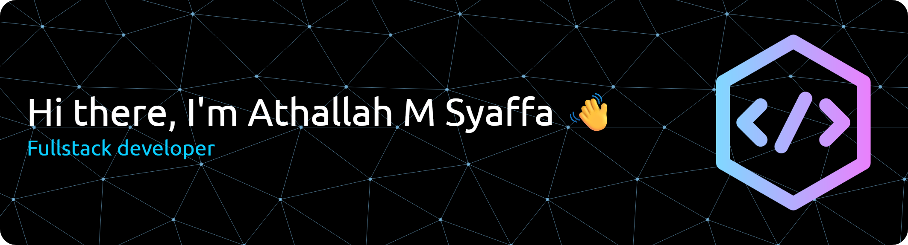

# 👋 Hi, I'm Athallah Muhammad Syaffa  

💻 A passionate **Fullstack Developer (Laravel & React)** in progress.  
🌱 Currently learning and building end-to-end web applications — from backend logic to modern, responsive user interfaces.  
🎯 **Goal:** Mastering the art of creating seamless digital experiences  

---

## 🚀 Tech Stack

### **Frontend**

  
  
  
  
  
  

### **Backend & Database**

  
  
  

### **Tools & Development**

  
  
  
  
  
  

### **Currently Learning**

  
  
  

---

## 📌 Featured Projects  

### 🔹 [Finote - Personal Finance Manager](https://github.com/athallahsy/finote)  
A comprehensive **personal finance management app** built with **Laravel 11 + MySQL + Bootstrap**.  
**Features:** Transaction tracking, category management, monthly financial reports, budget planning  
**Skills Demonstrated:** CRUD operations, database design, authentication, data visualization  

---

### 🔹 [Inkwell - Blog Platform](https://github.com/athallahsy/inkwell)  
A modern **blog application** built with **Laravel Breeze**.  
**Features:** User authentication, article management, categories, responsive design  
**Skills Demonstrated:** Laravel Breeze integration, content management, security implementation  

---

### 🔹 [Portfolio Website](https://github.com/athallahsy/portfolio)  
Personal portfolio website built with **React.js + Tailwind CSS**.  
**Features:** Responsive design, project showcase, contact form, modern UI/UX  
**Skills Demonstrated:** React components, Tailwind styling, responsive design  
**Live Demo:** [athallahsy.vercel.app](https://athallahsy.vercel.app)  

---

## 🔥 GitHub Activity  

  
  

  

---

## 🎯 What I'm Working On  
- 🔨 Building more **full-stack applications** with Laravel + React  
- 📚 Learning **Node.js** and **Express.js** for backend diversity  
- 🎨 Mastering **Tailwind CSS** for better UI/UX design  
- 🚀 Exploring **Next.js** for server-side rendering  
- 📱 Planning to learn **React Native** for mobile development  

---

## 💡 Fun Facts About Me  
- 🌅 I code better in the morning with a cup of coffee ☕  
- 🎮 When not coding, I enjoy playing strategy games  
- 📖 Always reading tech blogs and staying updated with latest trends  
- 🎯 My motto: *"Code with passion, debug with patience"*  

---

## 📫 Let's Connect!

  
  
  
  

 

---

  
### ✨ *"Every expert was once a beginner. Every pro was once an amateur."* ✨  
*Always learning, always building, always growing.* 🚀  

⭐️ From [Athallah Muhammad Syaffa](https://github.com/athallahsy)  

